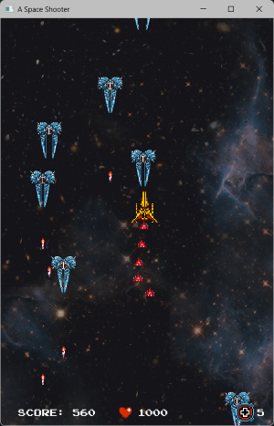
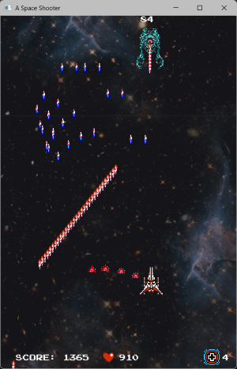

# A Space Shooter

Le français suit

  
  

## IDE
Visual Studio 2022

## About
This project was created in 2026 as a fourth-semester practical assignment at Cégep de Sainte-Foy.

## Description
In this game, you play as a spaceship and must fight against enemy ships.

## Enemies
There are two types of standard enemies:
- One flies straight downward.
- The other flies downward while following the player at varying speeds.

Both enemy types can shoot at you. There are 40 standard enemies in total.

The boss appears after all standard enemies have been defeated. It fires a large number of missiles.

## Bonuses
- **Health Bonus:** Restores 10 health points.
- **Plus Bonus:** Adds a mini ship that fights alongside you. If you are hit, one mini ship disappears instead of reducing your health. As long as you still have at least one mini ship, your health will not decrease when you are hit.

## Player
You control a spaceship that fires missiles from both sides. Your maximum health is **1000 HP**.

When hit by a standard enemy missile or by a standard enemy ship, you lose **50 HP** and become invincible for **2 seconds**.

Colliding with the boss while it is still alive results in instant death. When hit by a boss missile you lose **100 HP**

## Point System
- **+10 points** for destroying a standard enemy that flies straight.
- **+20 points** for destroying a standard enemy that follows the player.
- **+20 points** for hitting the boss.
- **+5 points** for collecting a bonus.

## Controls

### Keyboard
- **↑** Move up
- **↓** Move down
- **←** Move left
- **→** Move right
- **Space** Shoot
- **Backspace** Become invincible (For developpement)
- **Esc** Leave the game

### Xbox Controller (!Different Xbox controller might have different button setings)
- **Left Stick** Move
- **Right Trigger** Shoot
- **Right Trigger** Shoot
- **Button A (0)** Play/Pause
- **Button Y (3)** Become invincible (For developpement)
- **Button View (Back) (6)** Leave the game

---

## À propos
Ce projet a été réalisé en 2026 dans le cadre d'un travail pratique de quatrième session au Cégep de Sainte-Foy.

## Description
Dans ce jeu, vous incarnez un vaisseau spatial et devez combattre des vaisseaux ennemis.

## Ennemis
Il existe deux types d'ennemis standards :
- L'un se déplace uniquement vers le bas.
- L'autre se déplace vers le bas tout en suivant le joueur à différentes vitesses.

Les deux types d'ennemis peuvent vous tirer dessus. Il y a un total de 40 ennemis standards.

Le boss apparaît une fois que tous les ennemis standards ont été éliminés. Il tire un grand nombre de missiles.

## Bonus
- **Bonus de santé :** Restaure 10 points de vie.
- **Bonus Plus :** Ajoute un mini-vaisseau qui combat à vos côtés. Si vous êtes touché, un mini-vaisseau disparaît au lieu de réduire votre santé. Tant qu'il vous reste au moins un mini-vaisseau, votre santé ne diminue pas lorsque vous êtes touché.

## Joueur
Vous contrôlez un vaisseau spatial qui tire des missiles des deux côtés. Votre santé maximale est de **1000 PV**.

Lorsque vous êtes touché par un missile d'un ennemi standard ou par un vaisseau ennemi standard, vous perdez **50 PV** et devenez invincible pendant **2 secondes**.

Entrer en collision avec le boss alors qu'il est encore en vie entraîne une mort instantanée. Si vous êtes touché par un missile du boss, vous perdez **100 PV**.

## Système de points
- **+10 points** pour avoir détruit un ennemi standard qui se déplace uniquement vers le bas.
- **+20 points** pour avoir détruit un ennemi standard qui suit le joueur.
- **+20 points** pour chaque coup porté au boss.
- **+5 points** pour chaque bonus ramassé.

## Contrôles

### Clavier
- **↑** Se déplacer vers le haut
- **↓** Se déplacer vers le bas
- **←** Se déplacer vers la gauche
- **→** Se déplacer vers la droite
- **Espace** Tirer
- **Backspace** Être invincible (Pour le développement)
- **Esc** Quitter le jeux

### Manette (!Différente manette Xbox peut avoir des réglages de boutons différents)
- **Joystick gauche** Se déplacer
- **Gâchette droite** Tirer
- **Bouton A (0)** Continuer/Pause
- **Bouton Y (3)** Être invincible (Pour le développement)
- **Bouton View (Back) (6)** Quitter le jeux